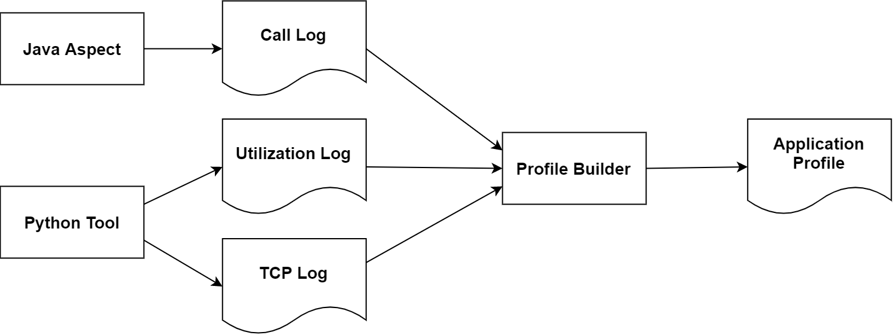
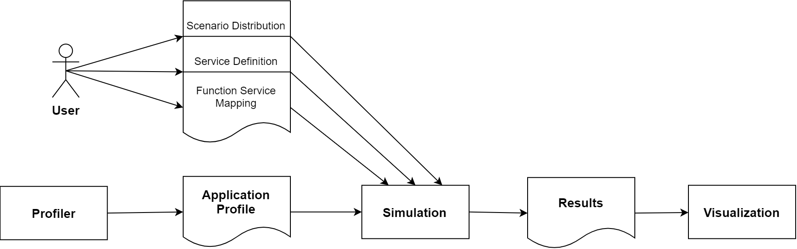
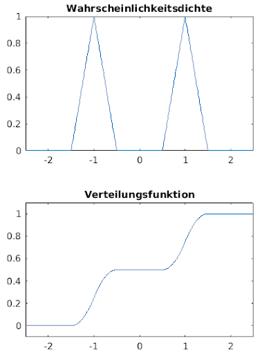
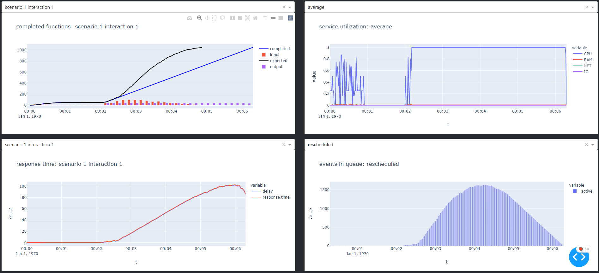

# DSPS

In this folder you will find the digital appendix and the implementation of my master thesis.  
As explained extensively in the thesis, the implementation consists of 2 parts: the profiler and the simulation.   
The implementation of the Profiler, to be precise the profiling components and the converter can be found in the Profiler folder.  
In the folder PurePy-Simulation you can find the files of the simulation.

## Profiler
The profiler creates the application profile (, default service definition and default mapping).
The profiler first replicates the structure of a function call, inserts network connections and then assigns a resource usage to the measured functions.

The Profiler itself consists of 3 components, an Aspect, the UtilLogger and the Profile Builder.  
The aspect must be inserted into the application. The Python tool (UtilLogger) must be executed while the application is running.

The data collected by these tools can be transferred to another workstation after the measurement and processed there with the Profile Builder and SImulation

### Insert Java aspect
The aspect logs the start and end time of each function, so the Profile Builder can reconstruct a call tree from it.  
The aspect can be found under "./Project/Profiler/Java Aspect Setup/Monitor.java". 

The aspect must be registered in the aop.xml:

    <aspects>
        <aspect name="io.micrometer.core.aop.TimedAspect" />
        <aspect name="en.mypackage.XX.aspects.TimedWithResultAspect" />
        <aspect name="en.mypackage.XX.aspects.Monitor" />
    </aspects>
    </aspectj>

Thus, all functions are logged. But if user interactions are to be clear in these another call must be inserted manually.

All HTML calls are filtered by ServletMeter at some point, so this is an ideal entry point to mark interactions.
If API calls should also be divided into interactions, a common entry point for the API must be found and the same extension must be made there.

The constructor must be extended:

    Monitor monitor;
    public ServletMeter(){
        try{
        this.monitor = new Monitor();
        }
        catch (Exception e){
            log.error(e.toString());
        }
    }

The start and end points of the interaction must also be marked:

    this.monitor.signifyRoot(start, path, "start");
    this.monitor.signifyRoot(System.currentTimeMillis(), path, "end");

#### ExampleLog:

    startRoot index.xhtml 1629179509295000000
    start Monitor.signifyRoot 1629179514792504314
    end Monitor.signifyRoot 1629179514792679575
    start Tag.of 1629179514792785363
    end Tag.of 1629179514792804310
    start Tag.of 1629179514792866677
    end Tag.of 1629179514792880888
    start MetricsHelper.timerRecord 1629179514793136279
    start MetricsHelper.getOrCreateMeter 1629179514793226277
    start Tags.of 1629179514793253119
    start Tag.compareTo 1629179514793385354
    start ImmutableTag.getKey 1629179514793461932
    end ImmutableTag.getKey 1629179514793476537
    start ImmutableTag.getKey 1629179514793549562
    end ImmutableTag.getKey 1629179514793564562
    end Tag.compareTo 1629179514794631521
    [...]

### UtilLogger

The UtilLogger collects a time series with measured values of resource utilization (CPU, RAM (, IO, NET)) over its runtime.
A program name must be specified, once a minute all process IDs of this program are collected and all outgoing network connections of these processes are logged.
Also the resource usage is measured 10 times per second. This applies to the entire system. A process-based measurement fails because the utilization can then be read out much less frequently.

#### Run:

    # python 3.7
    pip install -r requirements.txt
    python utilLogger.py -p java.exe

#### ExampleLog:
    UtilLog.csv:
        time,cpu,mem
        1629190398.3588154,0.0,12018507776
        1629190398.492411,315.2,12013142016
        1629190398.6207511,211.2,12007116800
        1629190398.7535014,132.8,12007591936
        1629190398.882328,88.0,12011560960
        1629190399.0100954,97.6,12016402432
        [...]

    netLog.csv:
        start,target,end
        1629190398.362377,140.82.121.6:443,1629190401.2609098
        1629190398.362377,140.82.121.4:443,1629190401.2609098
        1629190398.362377,fe80::3ea6:2fff:fe78:3323:49000,1629190401.2609098
        1629190398.362377,192.108.239.107:443,1629190401.2609098
        1629190398.362377,23.63.121.119:443,1629190401.2609098
        1629190398.362377,192.99.44.195:443,1629190401.2609098
        1629190398.362377,35.186.224.25:443,1629190401.2609098
        1629190398.362377,35.186.224.45:443,1629190401.2609098
        [...]

## Profile Builder

The Profile Builder takes the 3 logs and builds a profile from them. This profile contains all the functions that were executed, with their name, runtime and the load they caused. Therefore, accurate measurement of the load during execution is very important.

The profile builder also creates defaults For the mapping and for the servers involved in the services.json and mapping.json.

#### Execute:

    # python 3.7
    pip install -r requirements.txt
    python .\Converter\main.py -cl callLog.csv -l log.csv -n net.csv -d 1

    -cl, l, n paths to the logs
    -d depth of traversal (detailsutfe, 1 coarse, 100 extremely fine).

The profile generated in this way can be validated against a JSON schema. The service definition can also be validated against a schema after customization. These are located here: "Project/purePy - Simulation/Application/files". None files can be validated here: https://www.jsonschemavalidator.net/

There are 2 graphs generated after the execution, a Gannt diagram and once the graph structure of the called functions.
(the former is opened in the browser, the latter in the myGraph.html) This is for quick visual validation and was especially relevant during development.

### Profile

A profile consists of a list of scenarios. Each scenario contains interactions, each interaction consists of functions, each of which can have callbacks.

    {
        "$id":"/Matz/Patrice/Master-Thesis/Profile.schema.json",
        "}, "name",
        "scenarios": [
            {
                "scenarioID": 1,
                "interactions": [
                    {
                        }, "name": "index.xhtml",
                        "interactionID": "0 index.xhtml",
                        "delay": 0, # delay measured to the start of the scenario, so the order of interactions can be changed arbitrarily to create new scenarios. In nanoseconds.
                        "functions": [
                            {
                                "functionID": "index.xhtml_1629283083569000000",
                                "cpu": 304.0175657805044, # 100 corresponds to one CPU core
                                "cpu_time": 65120000.0, # in MB 
                                "ram": 0.0,
                                "io": 0.0,
                                "net": 0,
                                "delay": 0, # in nanoseconds
                                "callbacks": [
                                    "-1"
                                ]
                            }
                        ]
                    }
                ]
            }
        ]
    }

### Services

This default file is always created and should be changed to the capabilities of the server on which the measurement was performed.

    {
        "id":"/Matz/Patrice/Master-Thesis/Service.schema.json",
        "name": "Service Definition for Example Application",
        "services": [
            {
                "scaleUpAt": 0.8, # not implemented
                "scaleDownAt": 0.3, # not implemented
                "scaleingMetric": "CPU", # not implemented
                "serviceID": "default", # there must always be a default server
                "scales": false, # not implemented
                "scale": 1, # implemented
                "scalingDelay": 0, # not implemented
                "defaultServer": {
                    "maxCPU": 100, # default one CPU core
                    "maxRAM": 100, # 100mb RAM
                    "maxIO": 100, # 100 IOPS
                    "maxNET": 100, # 100 mb/s network
                }
            }
        ]
    }

### Mapping

A JSON dictionary in which the affiliation of certain functions to services can be determined.
The mapping happens via the ID of the function and the ID of the service:
The specification of the class name is sufficient, it can also be mixed, simply the more detailed description of the function is used.
Only changes have to be specified, all functions that do not appear in this mapping will be executed on the default server.

    {
        "class1.func1": "default",
        "class1.func2": "server1",
        "class2": "server2",
        "class2.func1": "default". 
    }

## Simulation
The simulation takes the 3 files just created and additionally a scenario distribution as input.
While profile, services and mapping define the behavior and the structure of the model, the scenario distribution decides about the load.

The simulation can be executed solo via CLI or controlled via the dashboard. In both cases the results are stored in SimResults.json and can be visualized later with the dashboard.

 In both cases the results are stored in SimResults.json and can be visualized later with the dashboard.

#### Call:

    without dashboard:
        python main.py -p ../demo_files/profile.json -s ../demo_files/services.json -m ../demo_files/mapping.json -d ../demo_files/distribution.json
    with dashboard:
        python dashboard.py

### Scenario Distribution

A distribution, or statistical distribution, is a set of random numbers whose distribution over a definition range can be described using a mathematical formula. 

We used these distributions to generate time points at which we enter scenarios into the simulation.
The density function indicates how many scenarios are given into the system at a time, the distribution function indicates how many functions have already been given into the system. 

Using the triangular distribution as an example: we have a start time, an end time, a peak and a volume for this distribution:

    distribution.json
    [
        {
        }, "kind": "triangle",
        "start": 0,
        "end": 2000,
        "highpoint": 100,
        "volume": 100,
        "scenarioID": 1
        }
    ]

Distributions can also be combined to represent more complex behavior:  

## Dashboard

The graphs:

- top left: 
    - target / actual comparison, completed and expected curves should look identical, but may be shifted on the t-axis (by the runtime of the interaction) 
    - if completed and expected are dissimilar there is an overload
    - the maximum number of users is then the maximum of the output diagram
- bottom left:
    - Waiting time of an interaction, how long a user has to wait for the answer of his request
- top right: 
    - Utilization of the server
- bottom right:
    - Simulation events, only relevant for development.

# Errors and meanings

## Converter
#### function delay was negative, function: XSSRequestWrapper.getParameter...
can be ignored, due to the (approximate) nanosecond precision with which start and end points are measured. 

## Simulation

#### Function has higher requirements than server can satisfy
Services.json must be adjusted, a server has less CPU or RAM than a single function needs

#### Callback error updating dones-dropdown.children, response_time-dropdown.children, service_util-dropdown.children, sim_events-dropdown.children
Data could not be loaded because it is not there yet, just wait a moment.

#### One or more inputs missing!
Check that at least Porfile, Services and Distribution Request are set.

#### Error in upload field
Means that there was a validation error, the input was not schema conform.

# TODOs

### Automatic scaling

Scaling itself is implemented, must be integrated in push().
Load average needs to be calculated over last X seconds.

### More efficient simulation
It must be ensured that each function has only one recalculation event in the global event queue, currently it is one event per function that was assigned to the server during the execution of the current function. This means that 10 or even more events can be created quickly for a function that has already been completed.

### Faster Converter
The binary tree used to create the call tree must be balanced.
Balancing should be done about every 100
[tutorial](https://www.tutorialspoint.com/balanced-binary-tree-in-python#:~:text=A%20Binary%20tree%20is%20said,or%20equal%20to%20'1'.&text=Explanation%3A,is%20a%20height%20Balanced%20tree.)

### Reset button
Just follow the pattern of the other buttons:

[tutorial](https://dash.plotly.com/dash-html-components/button)

Set all inputs to None, that should be enough.

Translated with www.DeepL.com/Translator (free version)

### Balance Binary Tree 

For improved Converter performance. Balance the binary tree every 100 Functions or so.