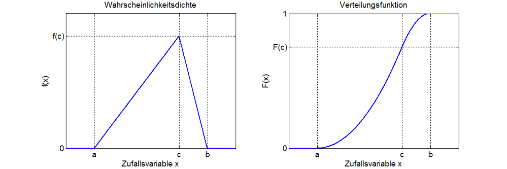

# DSPS

In diesem Ordner finden Sie den digitalen Anhang und die Implementierung meiner Masterthesis.  
Wie in der Thesis ausgiebig erläutert besteht die Implementierung aus 2 Teilen: dem Profiler und der Simulation.   
Die Implementierung des Profilers, um genau zu sein der Profilingkomponenten und des Converters finden Sie im Ordner Profiler.  
Im Ordner PurePy-Simulation finden Sie die Dateien der Simulation.

## Profiler
Der Profiler erzeugt das Application-Profile (, Default-Service Definition und Default Mapping).
Der Profiler bildet zuerst die Struktur eines Funktionsaufrufes nach, fügt Netzwerkverbindungen ein und weißt den gemessenen Funktionen anschließend eine Ressourcenauslastung zu.

Der Profiler selbst besteht aus 3 Komponenten, einem Aspect, dem UtilLogger und dem Profile Builder.  
Der Aspekt muss in die Applikation eingefügt werden. Das Python Tool (UtilLogger) muss während der Ausführung der Applikation ausgeführt werden.

Die Daten die diese Tools sammeln können nach der Messung auf eine andere Workstation übertragen werden und dort mit dem Profile Builder und der SImulation weiterverarbeitet werden

### Java Aspekt einfügen
Der Aspekt loggt den Start und Endzeitpunkt jeder Funktion, somit kann der Profile Builder einen Call Tree daraus rekonstruieren.  
Der Aspekt kann unter "./Projekt/Profiler/Java Aspekt Setup/Monitor.java" gefunden werden. 

Der Aspekt muss in der aop.xml registriert werden:

    <aspects>
        <aspect name="io.micrometer.core.aop.TimedAspect" />
        <aspect name="de.mypackage.XX.aspects.TimedWithResultAspect" />
        <aspect name="de.mypackage.XX.aspects.Monitor" />
    </aspects>
    </aspectj>

Somit werden alle Funktionen geloggt. Sollen aber Interaktionen des Nutzers in diesen deutlich werden muss ein weiterer Aufruf manuell eingefügt werden.

Alle HTML Aufrufe werden irgenwann vom ServletMeter gefiltert, das ist also ein idealer Einstiegspunkt um Interaktionen zu markieren.
Sollen API-Aufrufe ebenfalls in Interaktionen unterteilt werden, muss ein gemeinsamer Einstiegspunkt für das API gefunden werden und dort die Selbe erweiterung vorgenommen werden.

Der Konstruktor muss erweitert werden:

    Monitor monitor;
    public ServletMeter(){
        try{
        this.monitor = new Monitor();
        }
        catch (Exception e){
            log.error(e.toString());
        }
    }

Start und Endpunkt der Interaktion müssen ebenfalls markiert werden:

    this.monitor.signifyRoot(start, path, "start");
    this.monitor.signifyRoot(System.currentTimeMillis(), path, "end");

#### BeispielLog:

    startRoot index.xhtml 1629179509295000000
    start Monitor.signifyRoot 1629179514792504314
    end Monitor.signifyRoot 1629179514792679575
    start Tag.of 1629179514792785363
    end Tag.of 1629179514792804310
    start Tag.of 1629179514792866677
    end Tag.of 1629179514792880888
    start MetricsHelper.timerRecord 1629179514793136279
    start MetricsHelper.getOrCreateMeter 1629179514793226277
    start Tags.of 1629179514793253119
    start Tag.compareTo 1629179514793385354
    start ImmutableTag.getKey 1629179514793461932
    end ImmutableTag.getKey 1629179514793476537
    start ImmutableTag.getKey 1629179514793549562
    end ImmutableTag.getKey 1629179514793564562
    end Tag.compareTo 1629179514794631521
    [...]

### UtilLogger

Der UtilLogger sammelt eine Zeitreihe mit Messwerten der Ressourcenauslastung (CPU, RAM (, IO, NET)) über seine Laufzeit.
Es muss ein Programmname angegeben werden, einmal die Minute werden alle ProzessIDs dieses Programmes gesammelt und alle ausgehenden Netzwerkverbindungen dieser Prozesse geloggt.
Ebenso wird die Ressourcenauslastung 10 mal pro Sekunde gemessen. Diese gilt für das gesamte System. Eine Prozessbasierte Messung scheitert daran, dass die Auslastung dann deutlich seltener ausgelesen werden kann.

#### Ausführen:

    # python 3.7
    pip install -r requirements.txt
    python utilLogger.py -p java.exe

#### BeispielLog:
    UtilLog.csv:
        time,cpu,mem
        1629190398.3588154,0.0,12018507776
        1629190398.492411,315.2,12013142016
        1629190398.6207511,211.2,12007116800
        1629190398.7535014,132.8,12007591936
        1629190398.882328,88.0,12011560960
        1629190399.0100954,97.6,12016402432
        [...]

    netLog.csv:
        start,target,end
        1629190398.362377,140.82.121.6:443,1629190401.2609098
        1629190398.362377,140.82.121.4:443,1629190401.2609098
        1629190398.362377,fe80::3ea6:2fff:fe78:3323:49000,1629190401.2609098
        1629190398.362377,192.108.239.107:443,1629190401.2609098
        1629190398.362377,23.63.121.119:443,1629190401.2609098
        1629190398.362377,192.99.44.195:443,1629190401.2609098
        1629190398.362377,35.186.224.25:443,1629190401.2609098
        1629190398.362377,35.186.224.45:443,1629190401.2609098
        [...]

## Profile Builder

Der Profile Builder nimmt die 3 Logs und baut ein Profile daraus. Dieses Profile enthält alle Funktionen die ausgeführt wurden, mit ihrem Namen, Laufzeit und der Auslastung die sie verursacht haben. Daher ist die akkurate Messung der Auslastung während der Ausführung sehr wichtig.

Der Profile Builder erzeugt auch Defaults Für das Mapping und für die beteiligten Server in der services.json und mapping.json.

#### Ausführen:

    # python 3.7
    pip install -r requirements.txt
    python .\Converter\main.py -cl callLog.csv -l log.csv -n net.csv -d 1

    -cl, l, n   Pfade zu den Logs
    -d          Tiefe der Traversierung (Detailsutfe, 1 grob, 100 extrem fein)

Das so erzeugt Profil kann gegen ein JSON Schema validiert werden. Auch die Service Definition kann nach der Anpassung gegen ein Schema validiert werden. Diese liegen hier: "Projekt/purePy - Simulation/Application/files". Keinere Dateien können hier validiert werden: https://www.jsonschemavalidator.net/

Es werden nach der Ausführung 2 Grafiken erzeugt, ein Ganntdiagramm und einmal die Graphen Struktur der aufgerufenen Funktionen.
(ersteres wird im Browser geöffnet, letzteres in der myGraph.html) Dies dient der schnellen visuellen Validierung und war vorallem während der Entwicklung relevant.

### Profil

Ein Profil besteht aus einer Liste von Szenarien. Jedes Szenario enthält Interaktionen, jede Interaktion besteht aus Funktionen, die jeweils Callbacks besitzten können.

    {
        "$id": "/Matz/Patrice/Master-Thesis/Profile.schema.json",
        "name": "name",
        "scenarios": [
            {
                "scenarioID": 1,
                "interactions": [
                    {
                        "name": "index.xhtml",
                        "interactionID": "0 index.xhtml",
                        "delay": 0, # delay gemessen zum beginn des Szenarios, so kann die Reihenfolge der Interaktionen belibig geändert werden, um neue Szenarien zu erzeugen. In Nanosekunden.
                        "functions": [
                            {
                                "functionID": "index.xhtml_1629283083569000000",
                                "cpu": 304.0175657805044,   # 100 entspricht einem CPU-Kern
                                "cpu_time": 6512000000.0,   # in MB 
                                "ram": 0.0,
                                "io": 0.0,
                                "net": 0,
                                "delay": 0,                 # in Nanosekunden
                                "callbacks": [
                                    "-1"
                                ]
                            }
                        ]
                    }
                ]
            }
        ]
    }

### Services

Diese Default Datei wird immer erzeugt und sollte, auf die Fähigkeiten des Server auf dem die Messung ausgeführt wurde, geändert werden.

    {
        "id": "/Matz/Patrice/Master-Thesis/Service.schema.json",
        "name": "Service Definition for Example Application",
        "services": [
            {
                "scaleUpAt": 0.8,           # nicht implementiert
                "scaleDownAt": 0.3,         # nicht implementiert
                "scaleingMetric": "CPU",    # nicht implementiert
                "serviceID": "default",     # es muss immer einen default server geben
                "scales": false,            # nicht implementiert
                "scale": 1,                 # implementiert
                "scalingDelay": 0,          # nicht implementiert
                "defaultServer": {
                    "maxCPU": 100,          # Default ein CPU-Kern
                    "maxRAM": 100,          # 100mb RAM
                    "maxIO": 100,           # 100 IOPS
                    "maxNET": 100           # 100 mb/s Netzwerk
                }
            }
        ]
    }

### Mapping

Ein JSON Dictionary, in dem die Zugehörigkeit bestimmter Funktionen zu Servicen bestimmt werden kann.
Die Zuordnung passiert über die ID der Funktion und der ID des Services:
Die Angabe des Klassen Namen reicht aus, es kann auch gemischt werden, es wird ganz einfach die genauere Beschreibung der Funktion genutzt.
Es müssen nur Änderungen angegeben werden, alle Funktionen, die in diesem Mapping nicht auftauchen werden auf dem Default Server ausgeführt.

    {
        "class1.func1": "default",
        "class1.func2": "server1",
        "class2": "server2",
        "class2.func1": default 
    }

## Simulation
Die Simulation nimmt die 3 eben erzeugten Dateien und zusätzlich noch eine Szenario Verteilung als input.
Während Profil, Services und Mapping das Verhalten unddie Struktur des Modells vorgeben entscheidet die Szenario Verteilung über die anliegende Last.

Die Simulation kann solo per CLI ausgeführt werden oder über das Dashboard gesteuert werden. In beiden Fällen werden die Ergebnisse in der SimResults.json gespeichert und können später mit dem Dashboard visualisiert werden.

#### Aufruf:

    ohne dashboard:
        python main.py -p ../demo_files/profile.json -s ../demo_files/services.json -m ../demo_files/mapping.json -d ../demo_files/distribution.json
    mit dashboard:
        python dashboard.py

### Scenario Distribution

Eine Distribution oder auch statistische Verteilung, ist eine Menge von Zufallszahlen, deren Verteilung über einen Definitionsbereich mithilfe eine mathematischen Formel beschreibbar ist. 

Wir nutzten diese Verteilungen um Zeitpunkte zu erzeugen, zu denen wird Szenarien in die Simulation geben.
Die Dichtefunktion gibt ab wie viele Szenarien zu einem Zeitpunkt in das System gegeben werden, die Verteilungsfunktion gibt an wie viele Funktionen bereits in das System gegeben wurden. 

Am Beispiel der Dreiecksverteilung: wir haben einen Startzeitpunkt, einen Endzeitpunkt, einen Höhepunkt und ein Volumen für diese Verteilung:

    distribution.json
    [
        {
        "kind": "triangle",
        "start": 0,
        "end": 2000,
        "highpoint": 100,
        "volume": 100,
        "scenarioID": 1
        }
    ]

Verteilungen können auch kombiniert werden um komplexeres Verhalten abzubilden:  

## Dashboard

Die Graphen:

- links oben: 
    - Soll- / Ist-Vergleich, completed und expected Kurven sollten identisch aussehen, dürfen aber auf der t-Achsen verschoben sein (um die Laufzeit der Interaktion) 
    - sind completed und expected unähnlich gibt es eine Überlastung
    - Die maximale Nutzeranzahl ist dann das Maximum des Output-Diagrams
- links unten:
    - Wartezeit einer Interaktion, wie lange ein Nutzer auf die Antwort seiner Anfrage warten muss
- rechts oben: 
    - Auslastung der Server
- rechts unten:
    -  Simulations Events, nur für die Entwicklung relevant.

# Fehler und Bedeutungen

## Converter
#### function delay was negativ, function:  XSSRequestWrapper.getParameter...
kann ignoriert werden, liegt an der (annäherend) Nanosekundengenauigkeit mit der Start und Endzetpunkte gemessen werden 

## Simulation

#### Function has higher requirements than server can satisfy
Services.json muss angepasst werden, ein Server hat weniger CPU oder RAM als eine einzige Funktion braucht

#### Callback error updating dones-dropdown.children, response_time-dropdown.children, service_util-dropdown.children, sim_events-dropdown.children
Daten konnten nicht geladen werden, weil sie noch nicht da sind, einfach einen Moment warten.

#### One or more inputs missing!
Überprüfe, das mindestens Porfile, Services und Distribution Request gesetzt sind

#### Fehler in Uploadfeld
Heißt das es einen Fehler bei der Validierung gab, der Input war nicht Schemakonform.

# TODOs

### Automatische Skalierung

Skalierungs selbst ist implementiert, muss in push() integriert werden.
Auslastungsdruchschnitt muss über letzte X Sekunden berechnet werden.

### Effizientere Simulation
Es muss sichergestellt werden, dass jede Funktion nur ein Recalculation-Event in der globalen Event Queue hat, momentan ist es ein Event pro Funktion die während der Ausführung der aktuellen Funktion dem Server zugewiesen wurde. Es können also schnell 10 oder noch deutlich mehr Events erstellt werden, für eine Funktion,die bereits fertiggestellt wurde.

### Schnellerer Converter
Der Binary Tree der für die Erstellung des Call-Tree genutzt wird muss balanced werden.
Balancing sollte ca. alle 100 erfolgen
[tutorial](https://www.tutorialspoint.com/balanced-binary-tree-in-python#:~:text=A%20Binary%20tree%20is%20said,or%20equal%20to%20'1'.&text=Explanation%3A,is%20a%20height%20Balanced%20tree.)

### Reset button
Einfach am Muster der anderen Buttons orientieren:

[tutorial](https://dash.plotly.com/dash-html-components/button)

Alle Inputs auf None sezten, das sollte ausreichen.